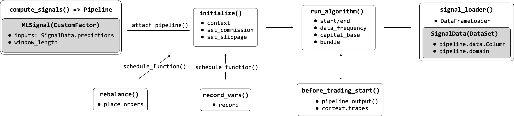
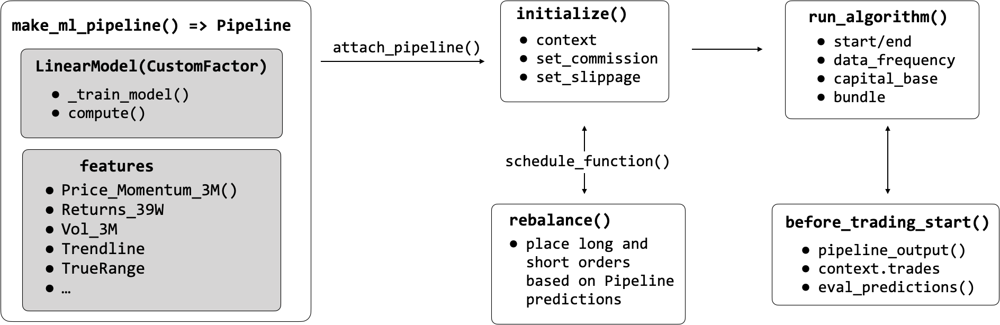

# Zipline: Production-ready backtesting by Quantopian

The backtesting engine Zipline powers Quantopian’s online research, backtesting, aur live (paper) trading platform. As a hedge fund, Quantopian aims to identify robust algorithms that outperform, subject to its risk management criteria. To this end, they have used competitions to select the best strategies aur allocate capital to share profits ke saath the winners.

Quantopian first released Zipline mein 2012 as version 0.5, aur the latest version 1.3 dates from July 2018. Zipline works well ke saath its sister libraries [Alphalens](https://quantopian.github.io/alphalens/index.html), [pyfolio](https://quantopian.github.io/pyfolio/), aur [empyrical](http://quantopian.github.io/empyrical/) that hum introduced mein Chapters 4 aur 5 aur integrates well ke saath NumPy, pandas aur numeric libraries, but may not always support the latest version.

## Vishay-suchi (Content)

1. [Installation](#installation)
2. [Zipline Architecture](#zipline-architecture)
3. [Exchange calendars aur the Pipeline API ke liye robust simulations](#exchange-calendars-aur-the-pipeline-api-ke liye-robust-simulations)
    * [Bundles and friends: Point-in-time data with on-the-fly adjustments](#bundles-and-friends-point-in-time-data-with-on-the-fly-adjustments)
    * [The Algorithm API: Backtests on a schedule](#the-algorithm-api-backtests-on-a-schedule)
    * [Known Issues](#known-issues)
4. [Code Example: How to load your own OHLCV bundles ke saath minute data](#code-example-how-to-load-your-own-ohlcv-bundles-ke saath-minute-data)
    * [Getting AlgoSeek data ready to be bundled](#getting-algoseek-data-ready-to-be-bundled)
    * [Writing your custom bundle ingest function](#writing-your-custom-bundle-ingest-function)
    * [Registering your bundle](#registering-your-bundle)
    * [Creating and registering a custom TradingCalendar](#creating-and-registering-a-custom-tradingcalendar)
5. [Code Example: The Pipeline API - Backtesting a machine learning signal](#code-example-the-pipeline-api---backtesting-a-machine-learning-signal)
6. [Code Example: How to train a model during the backtest](#code-example-how-to-train-a-model-during-the-backtest)
7. [Code Example: How to use the research environment on Quantopian](#code-example-how-to-use-the-research-environment-on-quantopian)

## Installation

Please follow the instructions mein the [installation](../../installation/) directory to use the patched Zipline version that hum'll use ke liye the examples mein this book.

> This notebook use karta hai the `conda` environment `backtest`. Please see the installation [instructions](../../installation/README.md) ke liye downloading the latest Docker image or alternative ways to set up your environment.

## Zipline Architecture

Zipline hai designed to operate at the scale ka thousands ka securities, aur each can be associated ke saath a large number ka indicators. It imposes more structure on the backtesting process than backtrader to ensure data quality by eliminating look-ahead bias, ke liye example, aur optimize computational efficiency while executing a backtest. 

Yeh section ka the book takes a closer look at the key concepts aur elements ka the architecture shown mein the following Figure before demonstrating how to use Zipline to backtest ML-driven models on the data ka your choice.

## Exchange calendars aur the Pipeline API ke liye robust simulations

Key features that contribute to the goals ka scalability aur reliability hain data bundles that store OHLCV market data ke saath on-the-fly adjustments ke liye splits aur dividends, trading calendars that reflect operating hours ka exchanges around the world, aur the powerful Pipeline API. Yeh section outlines their usage to complement the brief Zipline introduction mein earlier chapters.

### Bundles aur friends: Point-mein-time data ke saath on-the-fly adjustments

The principal data store hai a **bundle** that resides on disk mein compressed, columnar [bcolz](https://bcolz.readthedocs.io/en/latest/) format ke liye efficient retrieval, combined ke saath metadata stored mein an SQLite database. Bundles hain designed to contain only OHLCV data aur hain limited to daily aur minute frequency. A great feature hai that bundles store split aur dividend information, aur Zipline computes **point-mein-time adjustments** depending on the time period you pick ke liye your backtest. 

Zipline relies on the [Trading Calendars](https://zipline.ml4trading.io/trading-calendars.html) library (also maintained by Quantopian) ke liye operational details on exchanges around the world, such as time zone, market open aur closing times, or holidays. Data sources have domains (ke liye now, these hain countries) aur need to conform to the assigned exchange calendar. Quantopian hai actively developing support ke liye international securities, aur these features may evolve.

After installation, the command `zipline ingest -b quandl` lets you install the Quandl Wiki dataset (daily frequency) right away. The result ends up mein the `.zipline` directory that by default resides mein your home folder but can modify the location by setting the `ZIPLINE_ROOT` environment variable . mein addition, you can design your own bundles ke saath OHLCV data.

A shortcoming ka bundles hai that they do not let you store data other than price aur volume information. However, two alternatives let you accomplish this: the `fetch_csv()` function downloads DataFrames from a URL aur was designed ke liye other Quandl data sources, e.g. fundamentals. Zipline reasonably expects the data to refer to the same securities ke liye which you have provided OHCLV data aur aligns the bars accordingly. It’s not very difficult to make minor changes to the library's source code to load from local CSV or HDF5 use karke pandas instead, aur the [patched version](https://github.com/stefan-jansen/zipline) included mein the `conda` environment `backtest` includes this modification. 

mein addition, the `DataFrameLoader` aur the `BlazeLoader` permit you to feed additional attributes to a `Pipeline` (see the `DataFrameLoader` demo later mein the chapter). The `BlazeLoader` can interface ke saath numerous sources, including databases. However, since the Pipeline API hai limited to daily data, `fetch_csv()` will be critical to adding features at minute frequency as hum will do mein later chapters.

### The Algorithm API: Backtests on a schedule

The `TradingAlgorithm` class implements the Zipline Algorithm API aur operates on `BarData` that has been aligned ke saath a given trading calendar. After the initial setup, the backtest runs ke liye a specified period aur executes its trading logic as specific events occur. These events hain driven by the daily or minutely trading frequency, but you can also **schedule arbitrary functions** to evaluate signals, place orders, aur rebalance your portfolio, or log information about the ongoing simulation.

You can execute an algorithm from the command line, mein a Jupyter Notebook, aur by use karke the `run_algorithm()` method ka the underlying TradingAlgorithm class. The algorithm requires an `initialize()` method that hai called once when the simulation starts. It keeps state through a `context` dictionary aur receives actionable information through a `data` variable containing point-mein-time (PIT) current aur historical data. You can add properties to the context dictionary which hai available to all other `TradingAlgorithm` methods or register pipelines that perform more complex data processing, such as computing alpha factors aur filtering securities.

Algorithm execution occurs through optional methods that hain either scheduled automatically by Zipline or at user-defined intervals. The method `before_trading_start()` hai called daily before the market opens aur primarily serves to identify a set ka securities the algorithm may trade during the day. The method `handle_data()` hai called at the given trading frequency, e.g. every minute. 

Upon completion, the algorithm returns a DataFrame containing portfolio performance metrics if there were any trades, as well as user-defined metrics. As demonstrated mein [Chapter 5](../../05_strategy_evaluation), the output hai compatible ke saath [pyfolio](https://quantopian.github.io/pyfolio/) so that you can create quickly create performance tearsheets.

### Known Issues

[Live trading](https://github.com/zipline-live/zipline) your own systems hai only available ke saath Interactive Brokers aur not fully supported by Quantopian.

## Code Example: How to load your own OHLCV bundles ke saath minute data

hum will use the NASDAQ100 sample provided by AlgoSeek that hum introduced mein [Chapter 2](../../02_market_and_fundamental_data/02_algoseek_intraday) to demonstrate how to write your own custom bundle ke liye data at **minute frequency**. See [Chapter 11](../../11_decision_trees_random_forests/00_custom_bundle) ke liye an example use karke daily data on Japanese equities. 

There hain four steps:

1. Split your OHCLV data into one file per ticker aur store metadata, split aur dividend adjustments.
2. Write a script to pass the result to an `ingest()` function that mein turn takes care ka writing the bundle to bcolz aur SQLite format.
3. Register the bundle mein an `extension.py` script that lives mein your `ZIPLINE_ROOT/.zipline` directory (per default mein your user's home folder), aur symlink the data sources.
4. ke liye AlgoSeek data, hum also provide a custom `TradingCalendar` because it includes trading activity outside the standard NYSE market hours.

The directory [custom_bundles](01_custom_bundles) contain karta hai the code examples. 

### Getting AlgoSeek data ready to be bundled

mein [Chapter 2](../../02_market_and_fundamental_data/02_algoseek_intraday), hum parsed the daily files containing the AlgoSeek NASDAQ 100 OHLCV data to obtain a time series ke liye each ticker. hum will use this result because Zipline also stores each security individually.

mein addition, hum obtain equity metadata use karke the [pandas-dataReader](https://pandas-datareader.readthedocs.io/en/latest/) `get_nasdaq_symbols()` function. Finally, since the Quandl Wiki data covers the NASDAQ 100 tickers ke liye the relevant period, hum extract the split aur dividend adjustments from that bundle’s SQLite database.

The result hai an HDF5 store `algoseek.h5` containing price aur volume data on some 135 tickers as well as the corresponding meta aur adjustment data. The script [algoseek_preprocessing](algoseek_preprocessing.py] illustrates the process.

### Writing your custom bundle ingest function

The Zipline [documentation](https://zipline.ml4trading.io/bundles.html#writing-a-new-bundle) outlines the required parameters ke liye an `ingest()` function that kicks off the I/O process but does not provide a lot ka practical detail. The script `algoseek_1min_trades.py` shows how to get this part to work ke liye minute data.

mein a nutshell, there hai a `load_equities()` function that provide karta hai the metadata, a `ticker_generator()` function that feeds symbols to a `data_generator()` which mein turn loads aur format each symbol’s market data, aur an `algoseek_to_bundle()` function that integrates all pieces aur returns the desired `ingest()` function. 

Time zone alignment matters because Zipline translates all data series to UTC; hum add `US/Eastern` time zone information to the OHCLV data aur convert it to UTC. To facilitate execution, hum create symlinks ke liye this script aur the `algoseek.h5` data mein the `custom_data` folder mein the `.zipline` directory that hum’ll add to the PATH mein the next step so Zipline finds this information. To this end, hum run the following shell commands:

1. Assign the absolute path to this directory to `SOURCE_DIR`: `export SOURCE_DIR = absolute/path/to/machine-learning-ke liye-trading/08_strategy_workflow/04_ml4t_workflow_with_zipline/01_custom_bundles`
2. create symbolic link to 
    - `algoseek.h5` in `ZIPLINE_ROOT/.zipline`: `ln -s SOURCE_DIR/algoseek.h5 $ZIPLINE_ROOT/.zipline/custom_data/.`
    - `algoseek_1min_trades.py`: `ln -s SOURCE_DIR/algoseek_1min_trades.py $ZIPLINE_ROOT/.zipline/.`

### Registering your bundle

Before hum can run `zipline ingest -b algoseek`, hum need to register our custom bundle so Zipline knows what hum hain talking about. To this end, hum’ll add the following lines to an `extension.py` script mein the `.zipline` directory. You may have to create this file alongside some inputs aur settings (see the [extension](extension.py) example).

The registration itself hai fairly straightforward but highlights a few important details:
1. Zipline needs to be able to import the `algoseek_to_bundle()` function, so its location needs to be on the search path, e.g. by use karke `sys.path.append()`. 
2. hum reference a custom calendar that hum will create aur register mein the next step. 
3. hum need to inform Zipline that our trading days hain longer than the default six aur a half hours ka NYSE days to avoid misalignments.

### Creating aur registering a custom TradingCalendar

As mentioned mein the introduction to this section, Quantopian also provide karta hai a `Trading Calendar` library to support trading around the world. The package contain karta hai numerous examples that hain fairly straightforward to subclass. Based on the NYSE calendar, hum only need to override the open/close times, place the result mein `extension.py`, aur add a registration ke liye this calendar. aur now hum can refer to this trading calendar to ensure a backtest includes off-market-hour activity.

## Code Example: The Pipeline API - Backtesting a machine learning signal

The [Pipeline API](https://www.quantopian.com/docs/user-guide/tools/pipeline) facilitates the definition aur computation ka alpha factors ke liye a cross-section ka securities from historical data. The Pipeline significantly improves efficiency because it optimizes computations over the entire backtest period rather than tackling each event separately. mein other words, it continues to follow an event-driven architecture but vectorizes the computation ka factors where possible. 

A Pipeline use karta hai Factors, Filters, aur Classifiers classes to define computations that produce columns mein a table ke saath PIT values ke liye a set ka securities. Factors take one or more input arrays ka historical bar data aur produce one or more outputs ke liye each security. There hain numerous built-mein factors, aur you can also design your own `CustomFactor` computations.

The following figure depicts how loading the data use karke the `DataFrameLoader`, computing the predictive `MLSignal` use karke the Pipeline API, aur various scheduled activities integrate ke saath the overall trading algorithm executed via the `run_algorithm()` function. hum go over the details aur the corresponding code mein this section.

You need to register your Pipeline ke saath the `initialize()` method aur can then execute it at each time step or on a custom schedule. Zipline provide karta hai numerous built-mein computations such as moving averages or Bollinger Bands that can be used to quickly compute standard factors, but it also allows ke liye the creation ka custom factors as hum will illustrate next. 

Most importantly, the Pipeline API renders alpha factor research modular because it separates the alpha factor computation from the remainder ka the algorithm, including the placement aur execution ka trade orders aur the bookkeeping ka portfolio holdings, values, aur so on.

Notebook [backtesting_with_zipline](04_ml4t_workflow_with_zipline/02_backtesting_with_zipline.ipynb) demonstrate karta hai the use ka the `Pipeline` interface while loading ML predictions from another local (HDF5) data source. More specifically, it loads the lasso model daily return predictions generated mein [Chapter 7](../../07_linear_models) together ke saath price data ke liye our universe into a Pipeline aur use karta hai a `CustomFactor` to select the top aur bottom 10 predictions as long aur short positions, respectively. 

The goal hai to combine the daily return predictions ke saath the OHCLV data from our Quandl bundle aur then to go long on up to 10 equities ke saath the highest predicted returns aur short on those ke saath the lowest predicted returns, requiring at least five stocks on either side similar to the backtrader example above. See comments mein the notebook ke liye implementation details.

## Code Example: How to train a model during the backtest

hum can also integrate the model training into our backtest. You can find the code ke liye the following end-to-end example ka our ML4T workflow mein the ml4t_with_zipline notebook.

Notebook [ml4t_with_zipline](04_ml4t_workflow_with_zipline/03_ml4t_with_zipline.ipynb) shows how to train an ML model locally as part ka a `Pipeline` use karke a `CustomFactor` aur various technical indicators as features ke liye daily `bundle` data use karke the workflow displayed mein the following figure:

The goal hai to roughly replicate the daily return predictions hum used mein the previous aur generated mein [Chapter 7](../../07_linear_models). hum will, however, use a few additional Pipeline factors to illustrate their usage. 

The principal new element hai a `CustomFactor` that receives features aur returns as inputs to train a model aur produce predictions. See notebook ke liye comments on implementation.

## Code Example: How to use the research environment on Quantopian

Notebook [ml4t_quantopian](04_ml4t_quantopian.ipynb) shows how to train an ML model on the Quantopian platform to utilize the broad range ka data sources available there.
